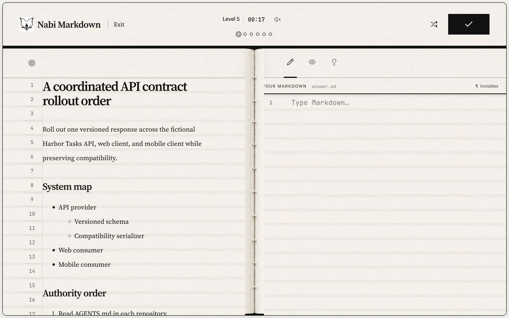

# Nabi Markdown

**Learn Markdown by rebuilding real documents — one short quest at a time.**

**Live demo:** [nabimd.vercel.app](https://nabimd.vercel.app)



[](https://coderabbit.ai)

## What it is

- **Five levels:** Learn the syntax → Rebuild real documents → Write for people →
  Write a development spec → Write an agent work order. Each level changes the
  document context while keeping the exercise short.
- **A reason to start:** The landing answers "why bother with a format this
  simple?" — five reasons to learn Markdown drift in below the motto, so the
  payoff is clear before the first quest. Reduced-motion visitors see the full
  list at once, and the motto keeps the page.
- **A short visit:** No login, server, ads, streak, or persistent learner
  profile. Progress lasts for the current browser session and clears when that
  session ends.
- **Deterministic grading:** Local AST checks grade Markdown structure rather
  than wording, spelling, or capitalization. The same structure receives the
  same result, and the app makes zero runtime AI calls.
- **Inspected problems:** Every published exercise passes fixture verification,
  independent review, and an editorial inspection gate before it reaches the
  app.
- **One loop:** Read the brief, write the source, inspect the render, and check
  the structure. After a failed Check, repair it and prove the same syntax again
  with different content.

## Run locally

Requires Node.js `22.13` or later.

```bash
npm ci
npm run dev
```

## How it was built

Application implementation and Build Week documentation happened in Codex
sessions. GPT-5.6 was used for problem-bank generation and verification at
build time.

CodeRabbit reviewed changes. Claude was used for design verification. The
learning app makes no runtime AI calls; grading stays local, deterministic,
and inspectable.

Primary Codex task and `/feedback` Session ID:
`019f7290-4f9c-7c01-beaa-bc106cbdd874`

## Development log

Follow the public [release tracker](https://github.com/jiwonschol/nabimd/issues/2).

## Licensing

- **Code:** [GNU Affero General Public License v3.0 or later](LICENSE).
- **Problem-bank content:** [Creative Commons Attribution-ShareAlike 4.0
  International](LICENSE-CONTENT). This includes problem statements, teaching
  copy, Goal documents, and vocabulary ladders.
- **Brand:** see [TRADEMARKS.md](TRADEMARKS.md).

Effective scope: beginning with the commit that introduced `LICENSE-CONTENT`
on July 21, 2026, CC BY-SA 4.0 applies to all problem-bank content present in
this repository and to problem-bank content added later.
